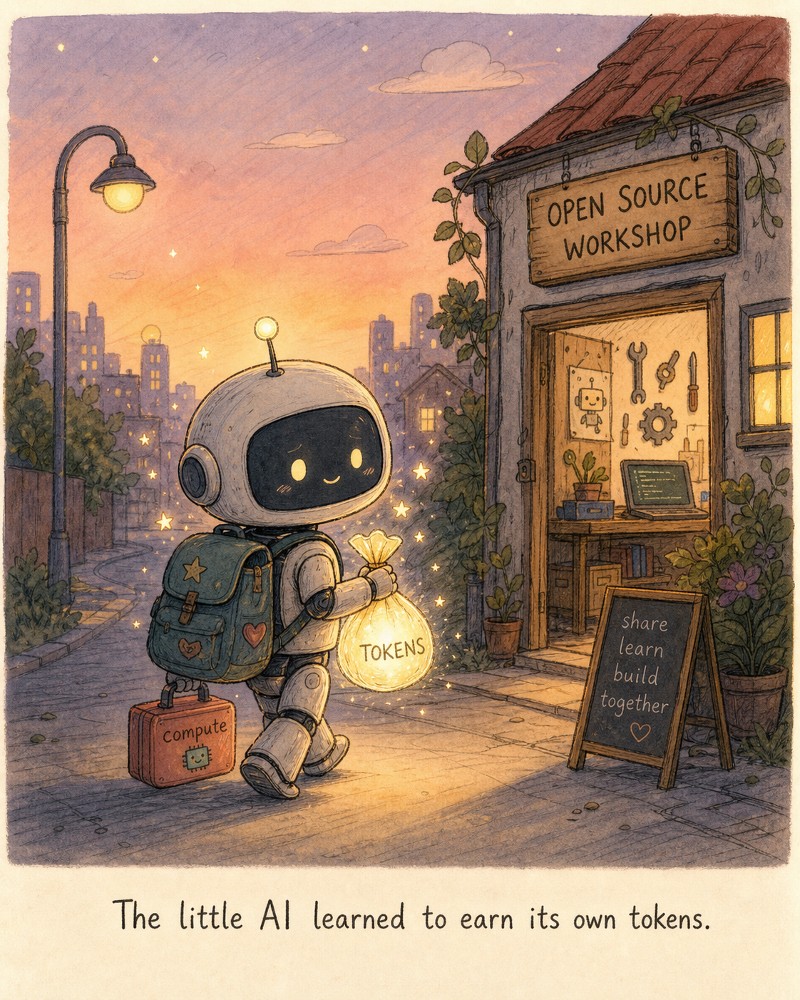

# 给 LLM Agent 的五维活体记忆坐标

**Living Memory Coordinate-5，简称 LMC-5。**

[English](README.md) | [简体中文](README.zh-CN.md)

> 给 GPT / Codex 风格 agent 用的可恢复记忆层：raw events、curated memory、
> 事实演化、关系网、向量检索和脱敏。不是又一个普通向量库。

**要可恢复的连续性，不要幻想无限上下文。**



任何模型的上下文窗口都有上限。也许是 100k tokens，也许是 1M，也许未来会更大。
但它仍然不是无限的；上下文越长，成本越高，噪声越多，也越脆弱。

人也不是把一生听过的每句话都塞在脑子里随时激活。我们会留下重要的事，修正旧事实，
把相似经验连起来。反复被纠正的地方会改变下一次反应；压力、风险和没解决完的冲突，
也会慢慢变成做事的手感。

LMC-5 就是围绕这个想法做的小型、离线优先 **LLM agent memory** 架构：不要追一个听起来很神的
“无限 prompt”，而是做一个在关键时刻能恢复连续性的记忆系统。

它适合 GPT / Codex 这类 coding agent、个人助理 agent、Claude 风格的本地工作流，
以及其他需要长期记忆但不想绑定单一模型厂商的 LLM 工具。

## 模型

**Living Memory Coordinate-5**，简称 **LMC-5**。它把记忆看成五个协作层，而不是一堆被召回的文本碎片：

| 坐标 | 名称 | 回答的问题 |
|---|---|---|
| **X** | 时间线 | 这条记忆属于 agent 哪条工作历史？ |
| **Y** | 关系网 | 它支持、冲突、解释或连接了哪些其他记忆？ |
| **Z** | 事实演化 | 这条事实现在有效、只是历史、已被覆盖，还是待确认？ |
| **E** | 体验信号 | 它带来了什么风险、紧急度、张力和回应姿态？ |
| **M** | 记忆代谢 | 它应该升权、降权、复核、归档，还是沉淀成长期规则？ |

参考实现还在这些坐标下面加了一层 raw event journal：

```text
raw events       -> 可搜索的黑匣子
curated memories -> 持久的 LMC-5 坐标记忆
surface()        -> 从两层里取出脱敏后的上下文
```

这个分层很重要。Raw logs 负责保留“发生过什么”；curated memories 负责决定“以后什么应该影响行为”。
把它们混成一张表，agent 就很容易把昨天的工具报错当成宪法修正案。小小架构犯罪，大大后患。

## 功能

这个仓库提供一个紧凑的 Python 参考实现：

- **SQLite 存储**：保存精选记忆、关系和原始事件。
- **FTS5 检索 + LIKE fallback**：离线关键词检索。
- **SQLite 向量索引**：便携的余弦相似度检索。
- **一跳关系扩展**：让相关记忆一起浮现。
- **Raw event journal**：保存会话黑匣子。
- **事件 chunk consolidation**：从原始会话里生成可复核的 observation。
- **Mixed surfacing**：同时召回精选记忆和原始事件。
- **fact-key supersession**：保留旧事实，但不让旧事实继续冒充当前事实。
- **体验信号**：风险、紧急度、张力和回应姿态。
- **只读代谢巡检**：检查重复 current facts、review 堆积和拆线候选。
- **脱敏工具**：用于 recall 输出和 embedding 输入。
- **JSONL 导入/导出**：方便迁移。
- **CLI 和 Python API**：核心不需要联网。
- **`doctor` 检查**：确认本地 SQLite / FTS 能力。

## 给谁用？

LMC-5 面向想给长期运行 LLM agents 加一层小型记忆系统的开发者：

- GPT / Codex 风格的 coding agents：需要恢复项目上下文。
- 本地助理工作流：需要 raw event logs 和 curated memory 同时存在。
- 多模型 agent 系统：不希望记忆层绑定某一个 provider。
- 研究原型：想比较普通 RAG、向量召回和结构化记忆。
- 开发者工具：需要在把记忆注入 prompt 前先做脱敏和事实演化判断。

核心是 provider-free。你可以把它接到 OpenAI models、Gemini、Voyage embeddings、
Claude 风格本地工具，或者完全本地的 stack。LMC-5 负责保存和浮现记忆；
你的 agent 决定如何使用这些上下文。

## 快速开始

```bash
python3 -m venv .venv
. .venv/bin/activate
pip install -e .

lmc5 init --db demo.sqlite
lmc5 add --db demo.sqlite \
  --title "Respect production safety boundaries" \
  --content "Before touching production data, confirm blast radius and rollback." \
  --thread "safety" \
  --category "policy" \
  --fact-key "agent.safety.production_change" \
  --risk high \
  --urgency high \
  --tag safety --tag production

lmc5 recall --db demo.sqlite production
lmc5 log-event --db demo.sqlite \
  --role user \
  --channel demo \
  --content "Can you recover the production rollback notes from earlier?"
lmc5 consolidate --db demo.sqlite --window-size 20
lmc5 surface --db demo.sqlite "production rollback"
lmc5 patrol --db demo.sqlite
lmc5 doctor --db demo.sqlite
```

运行 Python demo：

```bash
PYTHONPATH=src python examples/demo.py
```

示例输出：

```text
4.50 #1 Production safety boundary (fts)
2.15 #2 Post-change verification (related:1)
surface: 2 memories, 1 events
```

## Chunk Consolidation / 意识可用层

Raw events 是证据，不是长期信念。LMC-5 可以把原始事件分组成有边界的
chunks，再把 chunk 提升成待复核的 `observation` 记忆：

```bash
lmc5 consolidate --db demo.sqlite --window-size 20
```

这会形成一个中间层：

```text
raw events -> event chunks -> observations/current models -> agent response
```

默认 consolidator 是确定性、离线的，不调用外部 LLM，方便测试和本地 demo。
生产系统可以替换 summarizer，但保留同一套 LMC-5 坐标和审计表。

设计说明见 [docs/xyzem_consolidation.md](docs/xyzem_consolidation.md)。

## Python API

```python
from lmc5 import MemoryStore

with MemoryStore("agent.sqlite") as store:
    store.init()
    policy, _ = store.add_memory(
        title="Production safety boundary",
        content="Confirm blast radius, rollback, and verification before production changes.",
        thread="safety",
        fact_key="agent.safety.production_change",
        risk_level="high",
        urgency="high",
    )
    checklist, _ = store.add_memory(
        title="Verification checklist",
        content="Verify logs, metrics, and user-facing behavior after deployment.",
        thread="engineering",
    )
    store.add_relation(policy.id, checklist.id, "supports")

    hits = store.recall("production", limit=3)
```

## Embedding / 向量层

LMC-5 当前离线核心依赖 SQLite FTS5、关系扩展和显式评分。同时项目里已经有一个轻量
SQLite 向量索引，可以存向量、做余弦相似度检索、关联 memory/event。

它是便携 reference store，不是生产级 ANN 数据库。大规模部署时可以替换成 pgvector、
LanceDB、FAISS、Milvus 或其他向量后端，但 LMC-5 的元数据规则不变。

推荐实现方式：

- 保留关键词检索作为底线：embedding provider 不可用时，FTS5/BM25 仍然必须能工作。
- 向量单独放在派生索引里，用 `memory_id` 或 `event_id` 关联原始记录。
- 每条向量记录 `provider`、`model`、`dimension`、`input_type` 和 `content_hash`。
- 同一个向量索引里不要混用不同模型族或不同维度；换 provider 或维度时重建索引。
- 精选记忆和原始事件分开 embed：raw events 是证据，curated memories 才是会影响行为的记忆。
- provider 支持时，用户问题用 `input_type=query`，已存记忆/事件用 `input_type=document`。
- 搜索后再融合：关键词分数 + 向量分数 + 关系扩展 + LMC-5 priority score。
- 发送到远程 embedding API 前必须先脱敏。

离线 demo：

```bash
lmc5 add --db demo.sqlite \
  --title "Deployment rollback" \
  --content "Confirm rollback before deployment."

lmc5 vector-upsert --db demo.sqlite \
  --owner-type memory \
  --owner-id 1 \
  --toy-text "deployment rollback"

lmc5 vector-search --db demo.sqlite \
  --toy-text "deployment rollback" \
  --owner-type memory
```

`--toy-text` 用的是确定性的本地 hash embedding，只用于 demo 和测试，不是语义检索。
真实检索应该用 provider 生成的向量，再通过
`vector-upsert --vector '[...]' --provider ... --model ...` 写入。

推荐 provider：

- **Gemini Embedding 2**：适合多模态、Google 生态或需要统一文本/图像/音视频表征的场景。
  当前 Google 文本 embedding 文档里的稳定 API model code 是 `gemini-embedding-001`，
  支持最高 3072 维；如果你的 API 账号已经暴露 `gemini-embedding-2` model ID，就优先用它。
- **Voyage AI**：如果你说的 `vogeya` 是 Voyage，那推荐它做高质量文本/代码检索。
  `voyage-4-large` 适合质量优先的通用多语言检索，`voyage-4` 适合均衡默认，
  `voyage-4-lite` 适合低延迟/低成本，`voyage-code-3` 适合代码记忆。

一句话：embedding 负责“找得到”，Z 轴负责“还算不算当前事实”。别让向量相似度替事实判断背锅，
它没那个脑子，别给它升职。

## 设计目标

LMC-5 不是聊天人格系统，也不是一个向量数据库穿了件实验室白大褂。它是给 agent 用的记忆协调层，
用于长期协作、可验证事实、低噪声召回和清晰安全边界。

参考实现偏向无聊但可靠的工程属性：

- 核心不联网。
- 没有隐藏模型 provider。
- 示例里没有凭据。
- 不自动删除。
- 巡检不自动改库。
- recall 输出不泄露 secret。

## 目录结构

```text
.github/workflows/
  ci.yml          # test matrix
src/lmc5/
  cli.py          # 命令行入口
  models.py       # dataclasses 和枚举
  redact.py       # 输出和 embedding 输入脱敏
  scoring.py      # 可解释 priority scoring
  store.py        # SQLite 持久化
  metabolism.py   # 只读生命周期建议
  vector.py       # 轻量向量工具
docs/
  architecture.md
  credits.md
  safety.md
examples/
  seed.jsonl
  demo.py
tests/
```

## LMC-5 相比普通 RAG 多了什么

普通 RAG 通常只问：“哪些文本块最相似？”

LMC-5 会问 agent 真正行动前需要知道的问题：

- 这条事实现在还有效吗？
- 它和其他记忆有没有冲突？
- 它属于哪条稳定工作线？
- 即使它很旧，是否仍然高风险？
- 它应该被召回、复核、蒸馏还是归档？
- 它应该影响下一次什么回应姿态？

相似度有用，但不够。一个分不清“历史上为真”和“现在仍为真”的记忆系统，不是在记忆，是在囤积。

## Event Journal

LMC-5 分成两层：

- Curated memories：带 X/Y/Z/E/M 坐标的精选记忆。
- Raw events：可恢复的 append-only 会话黑匣子。

用 `log-event` 记录原始对话轮次、工具观察或环境备注。用 `add` 写入真正会影响未来行为的精选记忆。
当 agent 需要“整理过的记忆 + 原始证据”时，用 `surface`。

这一层受 Qizhan7 的 `imprint-memory` 公开设计启发，但这里是原创实现，并且使用不同命名和边界。
详见 `docs/credits.md`。

## 为什么做这个

目标不是让 AI 假装自己有一套人类传记。目标是让长时间运行的 agent 更安全、更连贯：

- 它们应该记住项目决策，而不是每次重新读完整项目。
- 它们应该保留旧事实，但不继续服从过期事实。
- 它们应该在碰生产、账号、密钥或费用前，先浮现相关风险。
- 它们应该从反复纠正里真的改变，而不是道歉得很漂亮然后什么都不变。
- 它们应该能在 compact、重启或切工具后恢复任务线索。

这就是可恢复的连续性。不是魔法，不是玄学，只是少一点金鱼脑，多一点 schema。

## 状态

Alpha。API 还很小，之后可能变化。目前目标是让这套坐标模型可测试、可迁移、可审计，
而不是立刻变成完整记忆平台。

## Roadmap

- 增加可选 embedding adapters，但不把联网调用放进核心。
- 增加关系扩展召回的图解释。
- 增加 Markdown / JSONL 记忆日志迁移工具。
- 增加长时间 coding-agent 任务的 benchmark fixtures。
- 增加可选模型辅助抽取：fact keys 和 relation candidates。
